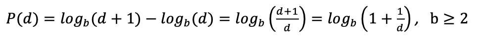
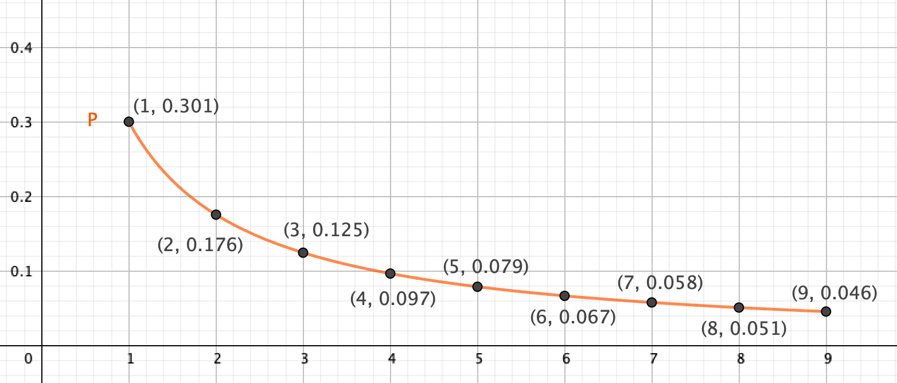
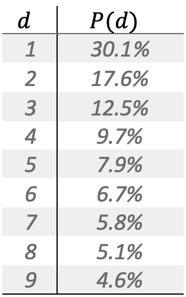

# Authenticity analysis of datasets using Benfords Law

This program is meant to help the user determine whether a dataset is authentic or if it is either tampered with or syntetical data. 

### Benfords Law

By comparing the occurences of the leading digits of a nummerical data, a pattern which often occurs is that the occurence of values with 1 as the leading digit makes up about 30% of the dataset, and that the next numbers (2, 3, ... ) all occur less frequent that the previous digit.

Benfords Law is named after the physicist Frank Benford, who were using the discoveries of Simon Newcomb as the basis of the law. The law states that the leading digit of a value in a dataset is likely to be small, and that the greater the leading digit, the probability of its occurence decreases. The law was put into a formal statement as follows:

The value of P(d) represents the probability of having a number with the leading digit d when picking a random value from the dataset. The base of the logarithm, b, will be determined by the number system which is used. (Binary -> b=2, Hex -> b=16, Default -> b=10).

When applying Benfords Law to the decimal system, the following probabilities is calculated:

